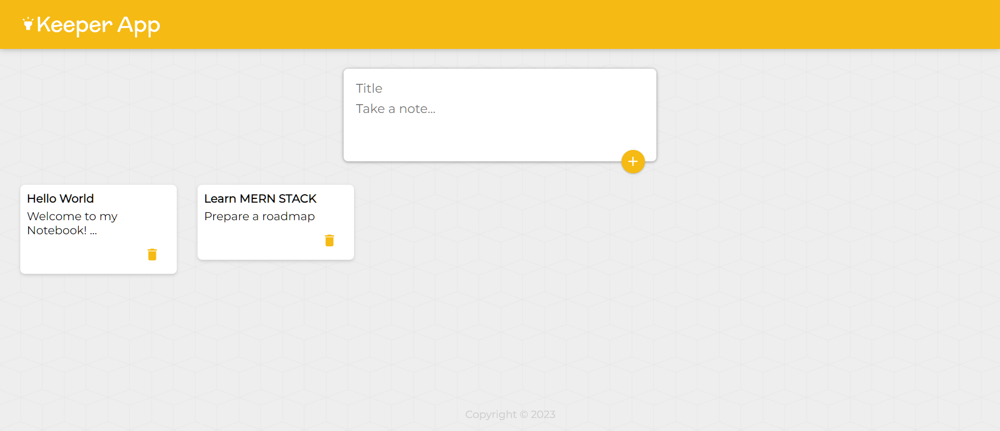

# Google Keep Clone

A simple and lightweight clone of Google Keep, designed for easy note-taking and organization.

## Snapshots




## Table of Contents

- [Features](#features)
- [Installation](#installation)
- [Usage](#usage)

## Features

- **Note Creation:** Easily create, edit, and delete notes.
- **Categories:** Organize your notes by adding categories or labels.
- **Search:** Quickly find notes using the search functionality.
- **Responsive Design:** Access and manage your notes seamlessly across devices.
- **Offline Support:** Use the application even without an internet connection.

## Installation

1. **Clone the Repository:**
   ```bash
   git@github.com:arkamaldeen/google-keep.git
2. **Install Dependencies**
   ```bash
   npm install

## Usage 

1. **Start the Application**
   ```bash
   npm start


## Usage Instructions:

- Create a new note by clicking on the "New Note" button.
- Edit and delete notes as needed.
